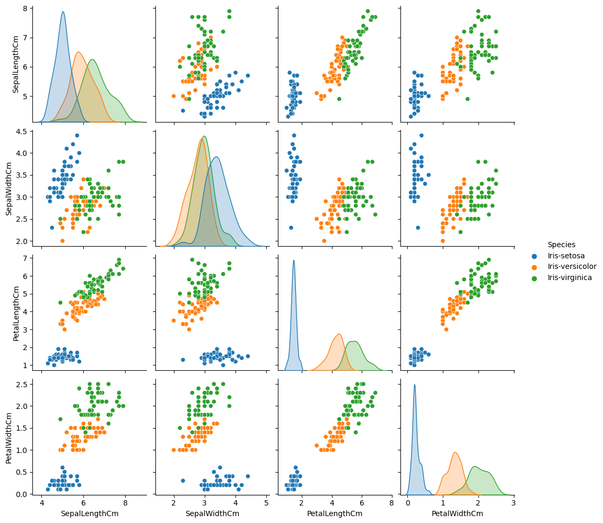
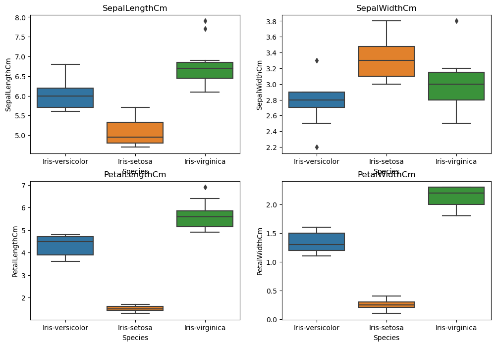
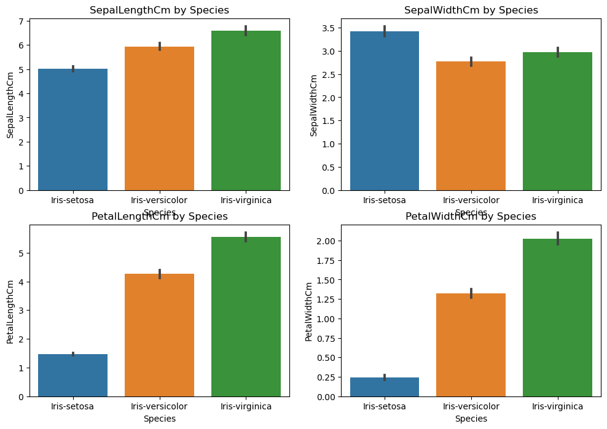
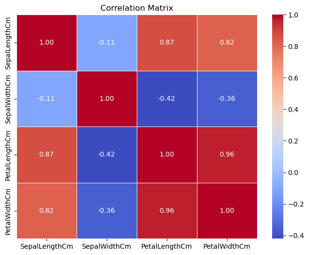
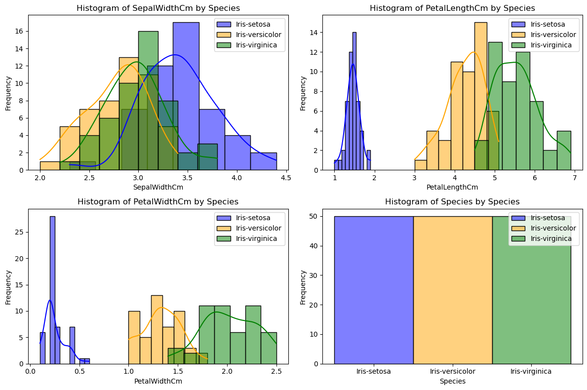

```python
# Here we are using SVM algorithm for classification because it is data efficient
import pandas as pd
from sklearn.model_selection import train_test_split
from sklearn.svm import SVC
from sklearn.metrics import accuracy_score, classification_report

# Load the Iris dataset with header
column_names = ['Id', 'SepalLengthCm', 'SepalWidthCm', 'PetalLengthCm', 'PetalWidthCm', 'Species']
iris_df = pd.read_csv('Iris.csv', header=0, names=column_names)

# Here we split the features from class labels
X = iris_df.drop('Species', axis=1)
y = iris_df['Species']

# Split both features and corresponding class labels into training and testing datasets
X_train, X_test, y_train, y_test = train_test_split(X, y, test_size=0.2, random_state=42)

clf = SVC(random_state=42)

# Train the classifier
clf.fit(X_train, y_train)

# Make predictions on the test set
y_pred = clf.predict(X_test)

accuracy = accuracy_score(y_test, y_pred)
print(f"Accuracy: {accuracy:.2f}")

print("Classification Report:\n", classification_report(y_test, y_pred))

```


```python
import pandas as pd
import seaborn as sns
import matplotlib.pyplot as plt
from sklearn.datasets import load_iris
```


```python
#This code plots a pair plot using Seaborn library. A pair plot is a grid of scatterplots for each pair of features in the dataset.
sns.pairplot(iris_df, hue='Species', height=2.5)
plt.show()

```


    

    


```python
# This code creates a set of box plots, each showing the distribution of a numerical feature in the Iris dataset for different species.
plt.figure(figsize=(12, 8))
for i, feature in enumerate(X.columns):
    plt.subplot(2, 2, i + 1)
    sns.boxplot(x=y_test, y=X_test[feature])
    plt.title(feature)
plt.show()
```


    

    


```python
#This code generates a set of bar plots, each showing the mean value of a numerical feature in the Iris dataset for different species.
plt.figure(figsize=(12, 8))
for i, feature in enumerate(X.columns):
    plt.subplot(2, 2, i + 1)
    sns.barplot(x='Species', y=feature, data=pd.concat([X, y], axis=1))
    plt.title(f'{feature} by Species')
plt.show()
```


    

    


```python
# This code gives the correlation matrix for the features of the dataset and then creates a heatmap to visually represent teh correlations between these features.
correlation_matrix = iris_df.corr()
plt.figure(figsize=(8, 6))
sns.heatmap(correlation_matrix, annot=True, cmap='coolwarm', fmt='.2f', linewidths=0.5)
plt.title('Correlation Matrix')
plt.show()
```

    C:\Users\shaik\AppData\Local\Temp\ipykernel_23372\3241494047.py:2: FutureWarning: The default value of numeric_only in DataFrame.corr is deprecated. In a future version, it will default to False. Select only valid columns or specify the value of numeric_only to silence this warning.
      correlation_matrix = iris_df.corr()
    


    

    


```python
# Separate the data by species
setosa = iris_df[iris_df['Species'] == 'Iris-setosa']
versicolor = iris_df[iris_df['Species'] == 'Iris-versicolor']
virginica = iris_df[iris_df['Species'] == 'Iris-virginica']

# This code plots histograms for each numerical feature in the Iris dataset, seperated based on species.
plt.figure(figsize=(12, 8))

for i, feature in enumerate(iris_df.columns[1:]):
    plt.subplot(2, 2, i + 1)
    sns.histplot(setosa[feature], label='Iris-setosa', kde=True, color='blue')
    sns.histplot(versicolor[feature], label='Iris-versicolor', kde=True, color='orange')
    sns.histplot(virginica[feature], label='Iris-virginica', kde=True, color='green')

    plt.title(f'Histogram of {feature} by Species')
    plt.xlabel(feature)
    plt.ylabel('Frequency')
    plt.legend()

plt.tight_layout()
plt.show()

```


    

    


```python

```


```python

```
